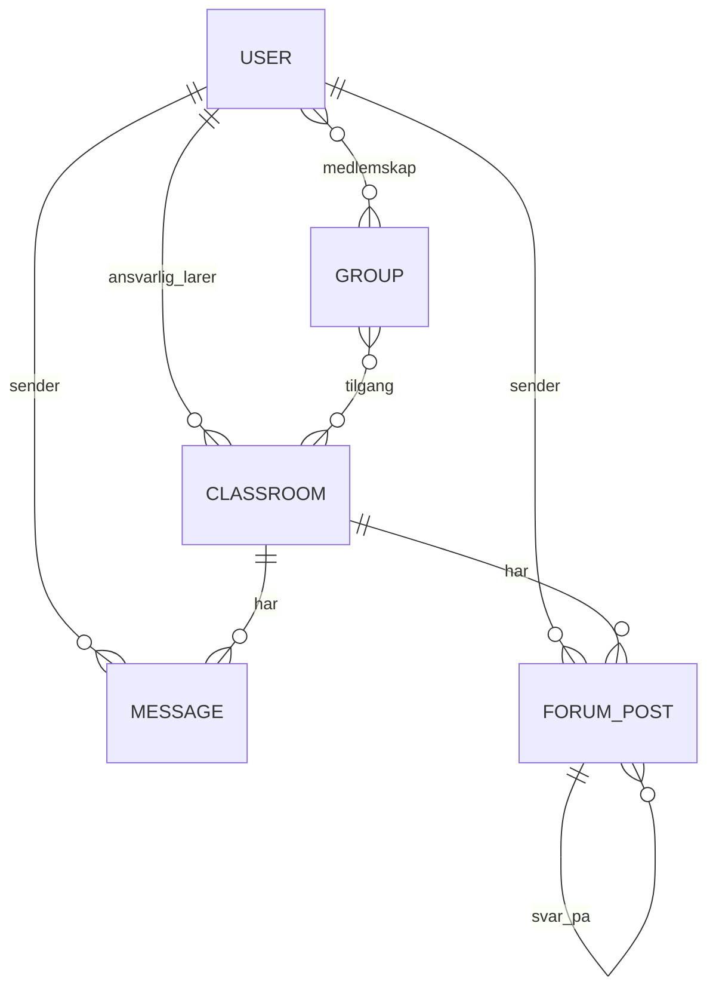
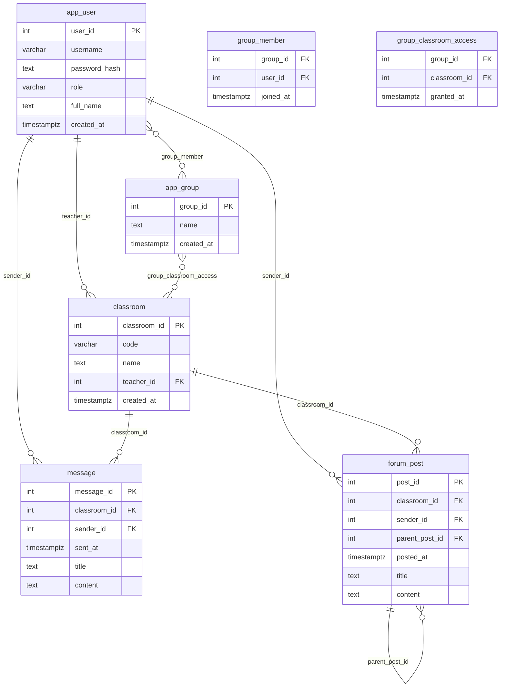

# Oppgavesett 1.4: Databasemodell og implementasjon for Nettbasert Undervisning

I dette oppgavesettet skal du designe en database for et nettbasert undervisningssystem. Les casen nøye og løs de fire deloppgavene som følger.

Denne oppgaven er en øving og det forventes ikke at du kan alt som det er spurt etter her. Vi skal gå gjennom mange av disse tingene detaljert i de nærmeste ukene. En lignende oppbygging av oppgavesettet, er det ikke helt utelukket at, skal bli brukt i eksamensoppgaven.

Du bruker denne filen for å besvare deloppgavene. Du må eventuelt selv finne ut hvordan du kan legge inn bilder (images) i en Markdown-fil som denne. Da kan du ta et bilde av dine ER-diagrammer, legge bildefilen inn på en lokasjon i repository og henvise til filen med syntaksen i Markdown. 

Det er anbefalt å tegne ER-diagrammer med [mermaid.live](https://mermaid.live/) og legge koden inn i Markdown (denne filen) på følgende måte:
```
```mermaid
erDiagram
    studenter 
    ...
``` 
Det finnes bra dokumentasjon [EntityRelationshipDiagram](https://mermaid.js.org/syntax/entityRelationshipDiagram.html) for hvordan tegne ER-diagrammer med mermaid-kode. 

## Case: Databasesystem for Nettbasert Undervisning

Det skal lages et databasesystem for nettbasert undervisning. Brukere av systemet er studenter og lærere, som alle logger på med brukernavn og passord. Det skal være mulig å opprette virtuelle klasserom. Hvert klasserom har en kode, et navn og en lærer som er ansvarlig.

Brukere kan deles inn i grupper. En gruppe kan gis adgang ("nøkkel") til ett eller flere klasserom.

I et klasserom kan studentene lese beskjeder fra læreren. Hvert klasserom har også et diskusjonsforum, der både lærere og studenter kan skrive innlegg. Til et innlegg kan det komme flere svarinnlegg, som det igjen kan komme svar på (en hierarkisk trådstruktur). Både beskjeder og innlegg har en avsender, en dato, en overskrift og et innhold (tekst).

## Del 1: Konseptuell Datamodell

**Oppgave:** Beskriv en konseptuell datamodell (med tekst eller ER-diagram) for systemet. Modellen skal kun inneholde entiteter, som du har valgt, og forholdene mellom dem, med kardinalitet. Du trenger ikke spesifisere attributter i denne delen.

**Ditt svar:***
Del 1: Konseptuell Datamodell (ER – uten attributter)

Entiteter:

Bruker (student eller lærer)

Klasserom

Gruppe

Beskjed (fra lærer i et klasserom)

Innlegg (foruminnlegg i et klasserom, med svar = hierarkisk tråd)

Relasjoner og kardinalitet:

En lærer kan være ansvarlig for mange klasserom (1:N).

Et klasserom har akkurat én ansvarlig lærer (N:1).

En bruker kan være medlem i mange grupper, og en gruppe kan ha mange brukere (M:N).

En gruppe kan få tilgang til mange klasserom, og et klasserom kan være tilgjengelig for mange grupper (M:N).

Et klasserom kan ha mange beskjeder, hver beskjed hører til ett klasserom (1:N).

Et klasserom kan ha mange innlegg, hvert innlegg hører til ett klasserom (1:N).

En bruker kan skrive mange beskjeder/innlegg, hvert innlegg/beskjed har én avsender (1:N).

Innlegg kan svare på ett annet innlegg (0/1 : N) → trådstruktur (self-relation).

Mermaid (konseptuell):



## Del 2: Logisk Skjema (Tabellstruktur)

**Oppgave:** Oversett den konseptuelle modellen til en logisk tabellstruktur. Spesifiser tabellnavn, attributter (kolonner), datatyper, primærnøkler (PK) og fremmednøkler (FK). Tegn et utvidet ER-diagram med [mermaid.live](https://mermaid.live/) eller eventuelt på papir.


**Ditt svar:***

Den konseptuelle modellen er oversatt til følgende tabellstruktur:

- app_user (brukere: studenter og lærere)
- classroom
- app_group
- group_member (koblingstabell mellom bruker og gruppe)
- group_classroom_access (koblingstabell mellom gruppe og klasserom)
- message (beskjeder i klasserom)
- forum_post (foruminnlegg med hierarkisk struktur via parent_post_id)

Primærnøkler (PK) og fremmednøkler (FK) er definert for å sikre referanseintegritet mellom tabellene.




## Del 3: Datadefinisjon (DDL) og Mock-Data

**Oppgave:** Skriv SQL-setninger for å opprette tabellstrukturen (DDL - Data Definition Language) og sett inn realistiske mock-data for å simulere bruk av systemet.


**Ditt svar:***

```sql
-- Drop i riktig rekkefølge
DROP TABLE IF EXISTS forum_post CASCADE;
DROP TABLE IF EXISTS message CASCADE;
DROP TABLE IF EXISTS group_classroom_access CASCADE;
DROP TABLE IF EXISTS group_member CASCADE;
DROP TABLE IF EXISTS app_group CASCADE;
DROP TABLE IF EXISTS classroom CASCADE;
DROP TABLE IF EXISTS app_user CASCADE;

-- Brukere
CREATE TABLE app_user (
  user_id        SERIAL PRIMARY KEY,
  username       VARCHAR(50) NOT NULL UNIQUE,
  password_hash  TEXT NOT NULL,
  role           VARCHAR(20) NOT NULL CHECK (role IN ('student', 'teacher')),
  full_name      TEXT NOT NULL,
  created_at     TIMESTAMPTZ NOT NULL DEFAULT now()
);

-- Klasserom
CREATE TABLE classroom (
  classroom_id   SERIAL PRIMARY KEY,
  code           VARCHAR(20) NOT NULL UNIQUE,
  name           TEXT NOT NULL,
  teacher_id     INT NOT NULL REFERENCES app_user(user_id) ON DELETE RESTRICT,
  created_at     TIMESTAMPTZ NOT NULL DEFAULT now()
);

-- Grupper
CREATE TABLE app_group (
  group_id     SERIAL PRIMARY KEY,
  name         TEXT NOT NULL,
  created_at   TIMESTAMPTZ NOT NULL DEFAULT now()
);

-- Medlemskap
CREATE TABLE group_member (
  group_id   INT NOT NULL REFERENCES app_group(group_id) ON DELETE CASCADE,
  user_id    INT NOT NULL REFERENCES app_user(user_id) ON DELETE CASCADE,
  joined_at  TIMESTAMPTZ NOT NULL DEFAULT now(),
  PRIMARY KEY (group_id, user_id)
);

-- Tilgang gruppe -> klasserom
CREATE TABLE group_classroom_access (
  group_id      INT NOT NULL REFERENCES app_group(group_id) ON DELETE CASCADE,
  classroom_id  INT NOT NULL REFERENCES classroom(classroom_id) ON DELETE CASCADE,
  granted_at    TIMESTAMPTZ NOT NULL DEFAULT now(),
  PRIMARY KEY (group_id, classroom_id)
);

-- Beskjeder
CREATE TABLE message (
  message_id    SERIAL PRIMARY KEY,
  classroom_id  INT NOT NULL REFERENCES classroom(classroom_id) ON DELETE CASCADE,
  sender_id     INT NOT NULL REFERENCES app_user(user_id) ON DELETE RESTRICT,
  sent_at       TIMESTAMPTZ NOT NULL DEFAULT now(),
  title         TEXT NOT NULL,
  content       TEXT NOT NULL
);

-- Foruminnlegg (hierarki)
CREATE TABLE forum_post (
  post_id        SERIAL PRIMARY KEY,
  classroom_id   INT NOT NULL REFERENCES classroom(classroom_id) ON DELETE CASCADE,
  sender_id      INT NOT NULL REFERENCES app_user(user_id) ON DELETE RESTRICT,
  parent_post_id INT NULL REFERENCES forum_post(post_id) ON DELETE CASCADE,
  posted_at      TIMESTAMPTZ NOT NULL DEFAULT now(),
  title          TEXT NOT NULL,
  content        TEXT NOT NULL
);

-- -------------------
-- MOCK DATA
-- -------------------

INSERT INTO app_user (username, password_hash, role, full_name) VALUES
('teacher_anna', 'hash1', 'teacher', 'Anna Lærer'),
('teacher_ola',  'hash2', 'teacher', 'Ola Lærer'),
('stud_jens',  'hash3', 'student', 'Jens Student'),
('stud_mina',  'hash4', 'student', 'Mina Student'),
('stud_sara',  'hash5', 'student', 'Sara Student'),
('stud_emil',  'hash6', 'student', 'Emil Student');

INSERT INTO classroom (code, name, teacher_id) VALUES
('DB-101', 'Databaser Grunnkurs', 1),
('WEB-202', 'Webutvikling', 2);

INSERT INTO app_group (name) VALUES
('Gruppe A'),
('Gruppe B');

INSERT INTO group_member (group_id, user_id) VALUES
(1, 3), (1, 4), (1, 5),
(2, 6);

INSERT INTO group_classroom_access (group_id, classroom_id) VALUES
(1, 1), (1, 2),
(2, 1);

INSERT INTO message (classroom_id, sender_id, title, content) VALUES
(1, 1, 'Velkommen', 'Velkommen til kurset!'),
(1, 1, 'Ukeplan', 'Her er ukeplanen.'),
(1, 1, 'Oblig 1', 'Oblig 1 er publisert.');

INSERT INTO forum_post (classroom_id, sender_id, title, content, parent_post_id)
VALUES
(1, 4, 'Spørsmål om PK/FK', 'Hva er forskjellen på PK og FK?', NULL);

INSERT INTO forum_post (classroom_id, sender_id, title, content, parent_post_id)
VALUES
(1, 1, 'Svar', 'PK identifiserer rad, FK peker til annen tabell.', 1);
```


## Del 4: Spørringer mot Databasen

**Oppgave:** Skriv SQL-spørringer for å hente ut informasjonen beskrevet under. For hver oppgave skal du levere svar med både relasjonsalgebra-notasjon og standard SQL.

### 1. Finn de 3 nyeste beskjeder fra læreren i et gitt klasserom (f.eks. klasserom_id = 1).

*   **Relasjonsalgebra:**
    > τ_{sent_at DESC} ( σ_{classroom_id=1} (MESSAGE) )

*   **SQL:**
    ```sql
    SELECT message_id, classroom_id, sender_id, sent_at, title, content
    FROM message
    WHERE classroom_id = 1
    ORDER BY sent_at DESC
    LIMIT 3; 
    ```

### 2. Vis en hel diskusjonstråd startet av en spesifikk student (f.eks. avsender_id = 2).

*   **Relasjonsalgebra**
    > Trenger ikke å skrive en relasjonsalgebra setning her, siden det blir for komplekst og uoversiktlig. 

*   **SQL (med `WITH RECURSIVE`):**

    Du kan vente med denne oppgaven til vi har gått gjennom avanserte SQL-spørringer (tips: må bruke en rekursiv konstruksjon `WITH RECURSIVE diskusjonstraad AS (..) SELECT FROM diskusjonstraad ...`)
    ```sql
    WITH RECURSIVE diskusjonstraad AS (
  SELECT
    p.post_id,
    p.parent_post_id,
    p.classroom_id,
    p.sender_id,
    p.posted_at,
    p.title,
    p.content,
    0 AS depth
  FROM forum_post p
  WHERE p.parent_post_id IS NULL
    AND p.sender_id = 4

  UNION ALL

  SELECT
    c.post_id,
    c.parent_post_id,
    c.classroom_id,
    c.sender_id,
    c.posted_at,
    c.title,
    c.content,
    dt.depth + 1
  FROM forum_post c
  JOIN diskusjonstraad dt
    ON c.parent_post_id = dt.post_id
)
    SELECT *
    FROM diskusjonstraad
    ORDER BY depth, posted_at;
    ```

### 3. Finn alle studenter i en spesifikk gruppe (f.eks. gruppe_id = 1).

*   **Relasjonsalgebra:**
    > π_{user_id, full_name, username}( σ_{group_id=1 ∧ role='student'} (group_member ⋈ app_user) )

*   **SQL:**
    ```sql
    SELECT u.user_id, u.full_name, u.username
    FROM group_member gm
    JOIN app_user u ON u.user_id = gm.user_id
    WHERE gm.group_id = 1
    AND u.role = 'student'
    ORDER BY u.full_name;
    ```

### 4. Finn antall grupper.

*   **Relasjonsalgebra (med aggregering):**
    >γ_{count(group_id)→antall_grupper}(app_group)
*   **SQL:**
   ```sql
   SELECT COUNT(*) AS antall_grupper
   FROM app_group;
    ```

## Del 5: Implementer i postgreSQL i din Docker container

**Oppgave:** Gjenbruk `docker-compose.yml` fra Oppgavesett 1.3 (er i denne repositorien allerede, så du trenger ikke å gjøre noen endringer) og prøv å legge inn din skript for opprettelse av databasen for nettbasert undervsining med noen testdata i filen `01-init-database.sql` i mappen `init-scripts`. Du trenger ikke å opprette roller. 

Lagre alle SQL-spørringene dine fra oppgave 4 i en fil `oppgave4_losning.sql` i mappen `test-scripts` for at man kan teste disse med kommando:

```bash
docker-compose exec postgres psql -U admin -d data1500_db -f test-scripts/oppgave4_losning.sql
```
